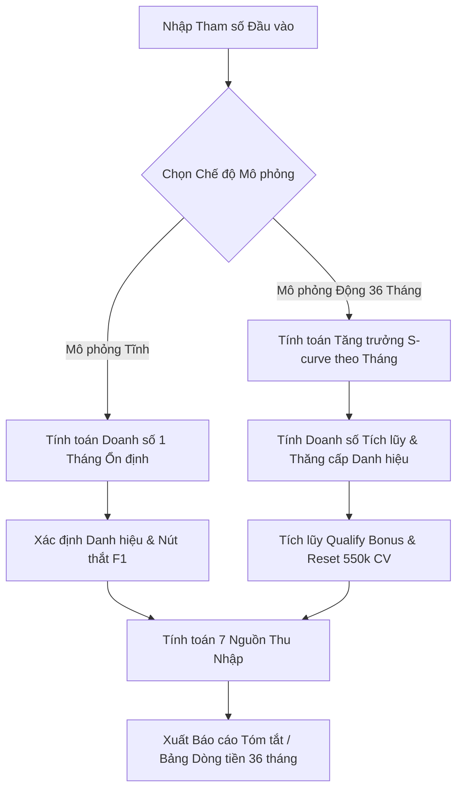
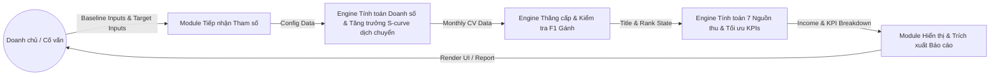

# FUNCTIONAL SPECIFICATION DOCUMENT (FSD)
## BỘ MÔ PHỎNG TÀI CHÍNH & DÒNG TIỀN VINALINK GROUP 36 THÁNG

**Mã tài liệu:** VNL-2026-FSD-03  
**Dự án:** Lập Kế hoạch Kinh doanh 3 năm - Doanh chủ Vinalink  
**Đơn vị xây dựng:** Lean Startup Team  
**Ngày phát hành:** 22-07-2026  
**Trạng thái:** Chính thức phê duyệt  

---

## 1. TỔNG QUAN HỆ THỐNG & PHẠM VI CHỨC NĂNG

### 1.1 Mục tiêu Hệ thống
Bộ mô phỏng tài chính Vinalink Group được xây dựng nhằm cung cấp một công cụ phản biện định lượng minh bạch cho các Doanh chủ hệ thống MLM và Cố vấn khởi nghiệp Lean Startup. Hệ thống cho phép giả lập các kịch bản phát triển mạng lưới, tính toán chính xác **7 Nguồn thu nhập độc lập**, tự động hóa quy trình thăng cấp danh hiệu và tích lũy thưởng duy trì (Qualify Bonus) theo chuỗi thời gian 36 tháng.

### 1.2 Người dùng Đích (Target Users)
1. **Doanh chủ Hệ thống (Network Leaders):** Đánh giá tính khả thi của mục tiêu tài chính 36 tháng, xây dựng lộ trình tuyển dụng F1 nòng cốt và tối ưu hóa cân nhánh nhị phân.
2. **Cố vấn Lean Startup (Startup Advisors):** Phản biện các mục tiêu thu nhập phi thực tế của học viên dựa trên các tham số hao hụt thực tế ($R_{retention}$, $R_{split}$).

---

## 2. KIẾN TRÚC CHỨC NĂNG & LUỒNG DỮ LIỆU

### 2.1 Sơ đồ Luồng Chức năng (Functional Flowchart)

### 2.2 Sơ đồ Luồng Dữ liệu (Data Flow Diagram - DFD Level 1)

---

## 3. ĐẶC TẢ CHI TIẾT CÁC TÍNH NĂNG CHỨC NĂNG

### 3.1 Chức năng 1: Thiết lập Tham số Đầu vào (Input Controls)
Hệ thống cung cấp giao diện tương tác hỗ trợ người dùng thiết lập 2 bộ tham số chính:

#### A. Tham số Hiện trạng (Baseline Inputs)
Dùng để xác định điểm xuất phát thực tế của đội nhóm Doanh chủ tại Tháng 0.

| Tên Tham số | Mã Tham số | Loại / Đơn vị | Khoảng Giá trị | Mặc định | Mô tả Chức năng |
| :--- | :--- | :--- | :--- | :--- | :--- |
| Quy mô hiện tại | `n_start` | Integer / Người | $2 - 1.000$ | $20$ | Quy mô tổng thành viên đội nhóm hiện tại. |
| NPP hoạt động hiện tại | `npp_start` | Integer / Người | $1 - 200$ | $6$ | Số lượng Nhà Phân Phối hoạt động năng động hiện tại. |
| KHTT hoạt động hiện tại | `khtt_start` | Integer / Người | $1 - 800$ | $15$ | Số lượng Khách Hàng Thân Thiết hoạt động hiện tại. |
| F1 nòng cốt hiện tại | `f1_start` | Integer / Người | $0 - 10$ | $1$ | Số lượng thủ lĩnh F1 trực hệ hiện tại. |
| Doanh số nhóm hiện tại | `cv_start` | Integer / CV | $0 - 50.000$ | $20.000$ | Doanh số nhóm phát sinh hiện tại của đội nhóm. |
| DS nhánh yếu hiện tại | `cv_weak_start` | Integer / CV | $0 - 25.000$ | $8.000$ | Doanh số phát sinh hiện tại ở nhánh yếu. |

#### B. Tham số Mục tiêu (Target Inputs)
Dùng để giả lập mục tiêu phát triển hệ thống sau 36 tháng.

| Tên Tham số | Mã Tham số | Loại / Đơn vị | Khoảng Giá trị | Mặc định | Mô tả Chức năng |
| :--- | :--- | :--- | :--- | :--- | :--- |
| Quy mô hệ thống tối đa | `n_total` | Integer / Người | $100 - 50.000$ | $10.000$ | Tổng quy mô thành viên tích lũy mục tiêu sau 36 tháng. |
| Tỷ lệ giữ chân NPP | `r_retention` | Float / % | $5\% - 100\%$ | $30.0\%$ | Tỷ lệ NPP hoạt động năng động hàng tháng. |
| Tỷ lệ nhánh Mạnh | `r_split_strong` | Float / % | $50\% - 95\%$ | $70.0\%$ | Tỷ lệ phân bổ doanh số tại Nhánh Mạnh ($R_{split}$). |
| Cấp bậc cá nhân | `personal_rank` | Enum | BRONZE, SILVER, GOLD | `GOLD` | Cấp bậc mua cá nhân (đầu tư 1 lần trọn đời). |
| Số F1 nòng cốt | `n_f1` | Integer / Người | $1 - 10$ | $3$ | Số lượng F1 trực hệ Doanh chủ bảo trợ trực tiếp mục tiêu. |
| Hệ số nhân bản | `dup_factor` | Integer / Hệ số | $x2 - x5$ | $x2$ | Hệ số sao chép chiều sâu cho tuyến dưới F2–F5. |
| Tỷ lệ F1 gánh nhánh | `f1_share` | Float / % | $10\% - 90\%$ | $50.0\%$ | Tỷ lệ doanh số nhánh do 1 F1 mạnh nhất gánh. |
| Chế độ mô phỏng động | `is_dynamic` | Boolean | True / False | `True` | Bật/tắt mô phỏng chuỗi thời gian 36 tháng. |

### 3.2 Chức năng 2: Thuật toán Thăng cấp Danh hiệu & Kiểm tra Ràng buộc F1 Gánh
1. **Danh hiệu tích lũy nhóm:** Hệ thống duyệt qua 10 cấp danh hiệu từ Manager ($80.000$ CV) đến Ambassador ($22.000.000$ CV).
2. **Kiểm tra nút thắt F1 gánh:** 
   * Doanh số tích lũy của F1 mạnh nhất ở nhánh yếu: $CV_{weak\_accumulated\_F1} = CV_{weak\_accumulated} \times f1\_share$.
   * Doanh số tích lũy của F1 mạnh nhất ở nhánh mạnh: $CV_{strong\_accumulated\_F1} = CV_{strong\_accumulated} \times f1\_share$.
   * Để thăng cấp Blue Diamond trở lên, F1 ở cả 2 nhánh phải đạt danh hiệu kế cận theo bảng tiêu chuẩn (Blue Diamond cần 2 F1 Diamond; Black Diamond cần 2 F1 Blue Diamond; Crown Diamond cần 2 F1 Black Diamond; Ambassador cần 2 F1 Crown Diamond). Nếu F1 không đạt chuẩn, danh hiệu Doanh chủ sẽ bị nghẽn (capped) tại cấp bậc tối đa đáp ứng được.

### 3.3 Chức năng 3: Thuật toán Tính toán Chi tiết 7 Nguồn Thu nhập
Hệ thống tính toán độc lập 7 nguồn thu nhập hàng tháng:

1. **Thu nhập Bán lẻ ($Income_1$):** Quy đổi $1\text{ CV} = 1.000\text{ VNĐ}$ lợi nhuận bán lẻ ($200\text{ CV/tháng} \rightarrow 200.000\text{ VNĐ/tháng}$).
2. **Hoa hồng Bảo trợ trực tiếp ($Income_2$):** Sơ đồ trực hệ $10\%$ F1-F2, $5\%$ F3-F5. Gold bảo trợ Gold nhận $2.000\text{ CV}$ ($2.000.000\text{ VNĐ}$). Doanh số bảo trợ thay đổi theo số lượng F1 tuyển mới tích lũy qua từng tháng.
3. **Hoa hồng Doanh số Nhóm - GVC ($Income_3$):** Dưới Dir (3k CV $\rightarrow$ 300k, thưởng 20 chu kỳ 6M); Từ Dir (7k CV $\rightarrow$ 560k, thưởng 8 chu kỳ 4.48M). Áp trần Maxout theo Rank/Title.
4. **Thưởng Duy trì Doanh số - Qualify Bonus ($Income_4$):** Tích lũy nhánh yếu cộng dồn mốc 80k/240k/550k CV. Chạm 550k CV nhận thưởng mốc 38M VNĐ (Gold) và **reset tích lũy về 0**.
5. **Hoa hồng Cộng hưởng - Matching Bonus ($Income_5$):** Hưởng $10\%$ F1-F2 và $5\%$ F3-F5 trên GVC tuyến dưới. Số NPP ở tầng $k$: $N_{npp}(k) = n\_f1\_current \times dup\_factor^{k-1}$.
6. **Hoa hồng Lãnh đạo - Leadership Commission ($Income_6$):** Đồng chia $1\% - 3.5\%$ doanh số nhánh yếu khi đủ điều kiện doanh số nhánh yếu tháng trước.
7. **Thưởng Vinh danh Hiện vật Cấp cao ($Income_7$):** Thưởng xe 1.1 tỷ (CD) và xe sang 1.9 tỷ (AMB).

### 3.4 Chức năng 4: Mô phỏng Chuỗi Thời gian 36 Tháng (Time-Series Forecasting)
Tăng trưởng quy mô hệ thống tích lũy tuân theo hàm Logistic S-curve dịch chuyển xuất phát từ quy mô hiện trạng Baseline ($N_{start}$):
$$N(t) = N_{start} + \frac{N_{total} - N_{start}}{1 + e^{-0.25 \times (t - 18)}}$$

### 3.5 Chức năng 5: Quy hoạch tuyến Tối ưu & Dự phòng KPIs hằng tháng
Tính toán lộ trình tối ưu và đề ra KPIs cụ thể từng tháng để Doanh chủ chuyển dịch từ hiện trạng tới mục tiêu:
1. **KPI F1 tuyển mới hằng tháng ($NewF1(t)$):**
   $$NewF1(t) = NewDistributors(t) \times \frac{n\_f1\_target - f1\_start}{N_{active\_npp\_target} - npp\_start}$$
2. **Số giờ làm việc tối ưu hằng ngày ($Hours(t)$):**
   $$Hours(t) = 4 + 0.5 \times NewF1(t) + 0.1 \times \log_2(N_{active\_distributors}(t))$$
   Với ràng buộc: $4.0 \le Hours(t) \le 6.0$ tiếng/ngày để hạn chế rủi ro burnout.
