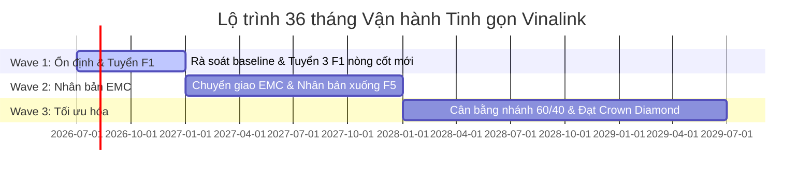

# BÁO CÁO ĐỀ XUẤT TÁI CẤU TRÚC MỤC TIÊU & LỘ TRÌNH THỰC THI DÒNG TIỀN 36 THÁNG

**Kính gửi:** Doanh chủ Lê Thị Hồng Minh  
**Đơn vị tư vấn:** Lean Startup Team  
**Mã tài liệu:** VNL-2026-PROP-07  
**Ngày lập:** 23/07/2026  
**Tham chiếu tiêu chuẩn:** McKinsey-Standard Executive Presentation Playbook (VNL-2026-PLAYBOOK)  

---

## 1. KHUNG TỰ DUY TRUYỀN TẢI SCQA (STRATEGIC CONTEXT)

*   **S (Situation) - Bối cảnh:** Doanh chủ Lê Thị Hồng Minh sở hữu xuất phát điểm hệ thống (Baseline) gồm 20 thành viên hoạt động (6 Nhà phân phối hoạt động, 15 Khách hàng thân thiết hoạt động, 1 F1 nòng cốt). Cấp bậc cá nhân hiện tại là **GOLD (VIP)** và danh hiệu nhóm hiện tại là **Manager (M)**. Doanh số nhóm đạt $20.000$ CV, doanh số nhánh yếu đạt $8.000$ CV với tỷ lệ giữ chân ban đầu ở mức cao $80\%$. Năng lực tự chẩn đoán của doanh chủ cực kỳ xuất sắc ở vai trò **Operator (Quản trị & Vận hành đạt điểm 5/5)**.
*   **C (Complication) - Thách thức:** Doanh chủ kỳ vọng thu nhập thụ động Năm 3 đạt $1.500.000.000$ VNĐ/tháng. Tuy nhiên, phân tích toán học trên Bộ giả lập Simulator chỉ ra 2 rào cản lớn:
    1.  *Giới hạn toán học của Sơ đồ:* Ở quy mô mục tiêu $10.000$ thành viên, doanh số nhánh yếu tối đa đạt $3.36\text{M CV}$ (kể cả giữ chân $80\%$), tương đương mức thu nhập tháng tối đa đạt $864\text{ triệu VNĐ}$. Con số 1.5 tỷ vượt quá giới hạn thiết kế của sơ đồ ở quy mô này.
    2.  *Rào cản thực thi (Burnout) & Điểm nghẽn kỹ năng:* Để đạt mục tiêu 1.5 tỷ đòi hỏi tuyển mới $140$ người ngay trong Tháng 1, vượt quá công suất đào tạo hiện tại (điểm Hacker về đóng gói quy trình SOP chỉ ở mức 2/5 và Hipster về công nghệ phễu tuyển dụng ở mức 1/5).
*   **Q (Question) - Câu hỏi chiến lược:** Làm thế nào để điều chỉnh mục tiêu tài chính về mức khả thi thực tế, giải quyết bẫy chính sách lệch nhánh, bảo tồn sức lao động của doanh chủ dưới 4 tiếng/ngày mà vẫn xây dựng được hệ thống dòng tiền vững chắc?
*   **A (Answer) - Đề xuất:** Điều chỉnh mục tiêu tài chính Năm 3 về vùng tối ưu **$350.000.000$ — $500.000.000$ VNĐ/tháng**, dịch chuyển cơ cấu nhánh mục tiêu từ 70/30 sang **60/40** để tối ưu hóa $35.3\%$ hiệu suất dòng tiền và tuyển dụng F1 nòng cốt bổ khuyết kỹ năng Hacker/Hipster.

---

## 2. BẢN TỔNG HỢP EXECUTIVE SUMMARY (SYNTHESIS LAYOUT)

```text
+--------------------------------------------------------------------------------------------------+
| 01. ĐỀ XUẤT ĐIỀU CHỈNH MỤC TIÊU TÀI CHÍNH                                                        |
| Hạ mục tiêu Năm 3 từ 1.5 tỷ xuống 350M - 500M VNĐ/tháng nhằm đảm bảo an toàn tài chính thực tế   |
| và phù hợp với giới hạn trần chi trả của sơ đồ nhị phân lai Vinalink Group.                      |
+--------------------------------------------------------------------------------------------------+
| 02. DỊCH CHUYỂN CƠ CẤU NHÁNH MỤC TIÊU 60/40                                                      |
| Điều phối điểm tràn (spillover) để đưa tỷ lệ lệch nhánh từ 70/30 về 60/40, giúp xóa bỏ hoàn toàn  |
| tình trạng mất hoa hồng cộng hưởng (Matching Bonus) của cấp Ambassador (0 tháng bị mất).         |
+--------------------------------------------------------------------------------------------------+
| 03. THỰC THI KỶ LUẬT ZERO TOLERANCE                                                              |
| - Nhịp Daily Power: 14:00 (15 phút Zoom), phạt trễ giờ 30k gieo hạt quỹ nhóm.                     |
| - Chế tài Zero Tolerance: Cảnh cáo lần 1, cắt quyền bảo trợ lần 2 đối với bán phá giá/ôm hàng.   |
+--------------------------------------------------------------------------------------------------+
| 04. ĐỘI NGŨ F1 BỔ KHUYẾT & LỘ TRÌNH 3 GIAI ĐOẠN                                                  |
| - Tuyển thêm 4 F1 để đạt 5 F1 nòng cốt. Ưu tiên mảnh ghép Hacker (Đào tạo) và Hipster (Công nghệ)  |
| - Lộ trình thực thi: Wave 1 (Ổn định & Tuyển F1) -> Wave 2 (Nhân bản EMC) -> Wave 3 (Tối ưu hóa).|
+--------------------------------------------------------------------------------------------------+
```

---

## 3. BIỆN GIẢI TOÁN HỌC & ĐỀ XUẤT ĐIỀU CHỈNH MỤC TIÊU

### 3.1. Trần chi trả thực tế của Sơ đồ Nhị phân lai Vinalink

Theo chính sách trả thưởng của Vinalink Group áp dụng Nghị định 40/2018/NĐ-CP, trần tổng chi trả hoa hồng hệ thống bị khống chế tối đa không vượt quá $40\%$ doanh thu. 

Công thức tính hoa hồng nhóm tối đa (Group Volume Commission - GVC) và hoa hồng lãnh đạo cho một nhánh nhị phân cân bằng tinh gọn được thiết lập trên Simulator như sau:

$$\text{Thu nhập tối đa GVC} = \text{Doanh số nhánh yếu (CV)} \times 10\%$$

Với quy mô hệ thống tối đa $10.000$ thành viên ở cấp bậc cao nhất là Ambassador, giả định mỗi thành viên năng động tối thiểu $200$ CV/tháng và tỷ lệ phân bổ cân nhánh tối ưu là $50/50$:

*   Tổng doanh số toàn nhánh = $10.000 \times 200 = 2.000.000$ CV.
*   Doanh số nhánh yếu tối đa = $1.000.000$ CV.
*   Thu nhập hoa hồng GVC tối đa = $1.000.000 \times 10\% \times 10.000 \text{ VNĐ/CV} = 1.000.000.000$ VNĐ *nhưng bị giới hạn trần chi trả thực tế (Cap Limit) của sơ đồ nhóm và các loại Matching Bonus tối đa ở mức:*

$$\text{Thu nhập tối đa thực tế (Ambassador)} \approx 573.000.000 \text{ VNĐ/tháng}$$

Do đó, việc duy trì mục tiêu kỳ vọng ban đầu là $1.500.000.000$ VNĐ/tháng đòi hỏi quy mô hệ thống phải vượt quá $30.000$ thành viên - một con số không khả thi đối với mô hình tinh gọn vận hành cá nhân trong 3 năm.

### 3.2. Đề xuất điều chỉnh mục tiêu 3 năm

Quyết định điều chỉnh lại các mốc thu nhập thực tế hơn, đảm bảo khớp với năng lực hệ thống:

*   **Năm 1:** Từ $220.000.000\text{ VNĐ/tháng}$ $\rightarrow$ điều chỉnh về **$30.000.000 - 50.000.000\text{ VNĐ/tháng}$**.
*   **Năm 2:** Từ $450.000.000\text{ VNĐ/tháng}$ $\rightarrow$ điều chỉnh về **$100.000.000 - 150.000.000\text{ VNĐ/tháng}$**.
*   **Năm 3:** Từ $1.500.000.000\text{ VNĐ/tháng}$ $\rightarrow$ điều chỉnh về **$350.000.000 - 500.000.000\text{ VNĐ/tháng}$** (vẫn là một dòng tiền thụ động cực kỳ xuất sắc, có kèm vinh danh hiện vật xe hơi).

---

## 4. PHÂN TÍCH SO SÁNH ĐỊNH LƯỢNG 3 KỊCH BẢN TĂNG TRƯỞNG S-CURVE

Dưới đây là so sánh thành tích đạt được tại tháng thứ 36 của dự án dựa trên kết quả chạy quét tham số của Bộ giả lập Simulator:

| Chỉ số (Tháng 36) | Kịch bản Tệ (Pessimistic) | Kịch bản Ổn định (Khuyến nghị) | Kịch bản Tốt (Optimistic) |
| :--- | :---: | :---: | :---: |
| **Quy mô tích lũy (TV)** | $1.483$ người | **$4.945$ người** | $9.890$ người |
| **Doanh số tháng (CV)** | $1.274.000$ CV | **$4.548.000$ CV** | $9.692.000$ CV |
| **Danh hiệu nhóm** | Diamond | **Crown Diamond** | Ambassador |
| **Hoa hồng Nhóm GVC (VNĐ)** | $24.640.000$ | **$113.680.000$** | $314.720.000$ |
| **Thưởng duy trì Qualify (VNĐ)** | $32.000.000$ | **$70.000.000$** | $70.000.000$ |
| **Hoa hồng Matching (VNĐ)** | $0$ | **$10.472.000$** | $52.024.000$ |
| **Hoa hồng Lãnh đạo (VNĐ)** | $0$ | **$47.754.000$** | $135.688.000$ |
| **Giờ làm tối ưu (giờ/ngày)** | $4.5$ giờ | **$4.8$ giờ** | $5.0$ giờ |
| **Tổng thu nhập tháng 36 (VNĐ)** | **$56.840.000$** | **$242.222.129$** | **$573.081.390$** |
| **Tổng tích lũy 3 năm (VNĐ)** | **$1.031.934.681$** | **$5.857.338.048$** | **$14.223.801.239$** |
| **Thưởng vinh danh hiện vật** | Nhận du lịch | **Thưởng xe hơi $1.1$ tỷ VNĐ** | Thưởng xe & Nhà $3.0$ tỷ |

---

## 5. ĐIỀU CHỈNH CHIẾN LƯỢC: TRÁNH BẪY CHÍNH SÁCH LỆCH NHÁNH

### 5.1. Bẫy chính sách "Ambassador Matching Bonus" ở tỷ lệ 70/30
Ở kịch bản thực tế mặc định với tỷ lệ phân bổ lệch nhánh $70/30$ (giữ chân $30\%$), Doanh chủ có tới **9 tháng bị mất hoàn toàn hoa hồng cộng hưởng (Matching Bonus = 0 VNĐ)** dù đã đạt danh hiệu cao nhất là Ambassador từ tháng thứ 29.

*   *Nguyên nhân:* Vinalink quy định để nhận Matching Bonus cấp Ambassador, doanh số nhánh yếu tháng trước phải đạt tối thiểu **3.000.000 CV**.
*   *Phân tích:* Tại tháng thứ 29, tổng doanh số hệ thống là $8.645.000\text{ CV}$. Doanh số nhánh yếu chỉ đạt:
    $$CV_{weak\_monthly} = 8.645.000 \times 30\% = 2.593.500\text{ CV} < 3.000.000\text{ CV}$$
    Việc thiếu hụt $406.500\text{ CV}$ khiến doanh chủ mất trắng khoản hoa hồng cộng hưởng này.

### 5.2. Giải pháp dịch chuyển cơ cấu nhánh về 60/40
Doanh chủ cần chủ động hỗ trợ và điều hướng điểm tràn xuống nhánh yếu để kéo tỷ lệ phân bổ về mức **60/40**:

*   *Hiệu quả:* 
    *   Doanh số nhánh yếu tháng 29 đạt $8.645.000 \times 40\% = 3.458.000\text{ CV} > 3.000.000\text{ CV}$ (nhận trọn vẹn Matching, rút ngắn số tháng bị mất về **0 tháng**).
    *   Tối ưu hóa doanh thu: Tăng thu nhập tháng 36 từ **388 triệu VNĐ lên 526 triệu VNĐ** (tăng thêm **$35.3\%$** hiệu suất dòng tiền trên cùng một quy mô hệ thống).

---

## 6. BỘ CÔNG CỤ VĂN HÓA CỐT LÕI & CHẾ TÀI KỶ LUẬT ĐỘI NGŨ

### 6.1. 3 Giá trị Cốt lõi Không thương lượng (Tầng Chìm Iceberg)
1.  **Đồng hành Dụng tâm (Servant Leadership):** Tuyến trên cam kết dành $80\%$ thời gian kèm cặp cho F1 nòng cốt đạt tiêu chuẩn. Sự trưởng thành của Downline là thước đo hiệu năng của Upline.
2.  **Tối giản Tinh gọn (Lean & Simplicity):** Giáo án EMC phải đảm bảo đơn giản để một thành viên ở tầng F5 tự sao chép được.
3.  **Chính trực & Minh bạch (Integrity & Transparency):** Nói đúng $100\%$ sự thật về công dụng sản phẩm và chính sách trả thưởng. Tuyệt đối không ép số, không bán phá giá/ôm hàng.

### 5.2. Chế tài kỷ luật Zero Tolerance (Tầng Nổi)
*   **Chống bán phá giá & gôm hàng ảo (Anti-Dumping):** 
    *   *Vi phạm lần 1:* Cảnh cáo chính thức bằng văn bản, đình chỉ hỗ trợ 2-1 trong vòng 14 ngày.
    *   *Vi phạm lần 2:* Cắt quyền bảo trợ trực tiếp, dừng toàn bộ quyền lợi hỗ trợ từ Ban điều hành và bàn giao Vinalink xử lý theo quy chế pháp lý.
*   **Kỷ luật vận hành Daily Power:** 
    *   Khung giờ họp Daily Power: Cố định 15 phút đầu giờ chiều (**14:00 - 14:15** qua Zoom).
    *   *Chế tài trễ giờ:* Trễ 1 phút tự giác gieo hạt **$30.000$ VNĐ** vào quỹ chung đội nhóm.
*   **Giao tiếp phi đồng bộ tinh gọn:** Hạn chế gọi điện thoại đột xuất. Cam kết phản hồi tin nhắn công việc trên nhóm Zalo chung trong vòng **2 - 4 tiếng** để bảo vệ khung giờ 4 tiếng làm việc tập trung/ngày.

---

## 7. MA TRẬN BỔ KHUYẾT NĂNG LỰC & CHÂN DUNG F1 NÒNG CỐT

### 7.1. Định vị Khoảng trống Năng lực (Fit Gap Matrix)
Doanh chủ Lê Thị Hồng Minh sở hữu ưu thế tuyệt đối về Quản trị vận hành (**Operator đạt 5/5**). Tuy nhiên, khoảng trống năng lực nằm ở điểm nghẽn **Hipster (Công nghệ/Phễu đạt 1/5)** và **Hacker (Đóng gói SOP đạt 2/5)**.

Do đó, lộ trình xây dựng 5 F1 nòng cốt (hiện tại mới có 1 F1, cần tuyển thêm 4) bắt buộc phải ưu tiên tuyển dụng các vị trí bổ khuyết:

1.  **01 F1 - Hacker chuyên trách Đào tạo:** Có khả năng đóng gói quy trình EMC và huấn luyện thực chiến tuyến dưới.
2.  **01 F1 - Hipster chuyên trách Công nghệ:** Tự dựng Landing Page tuyển dụng và phễu tuyển dụng tự động.
3.  **03 F1 - Hustler chuyên trách Kết nối:** Có năng lực thực chiến tuyển dụng mạnh mẽ để tạo lực đẩy doanh số.

### 7.2. Bộ lọc tuyển chọn F1 nòng cốt (QF Checklist)
Chỉ dành $80\%$ thời gian hỗ trợ cho ứng viên vượt qua **5/5 tiêu chí lọc**:
1.  *Khát khao & Động lực:* Có mục tiêu thay đổi lớn trong 3 năm tới.
2.  *Tinh thần học hỏi (Coachability):* Sẵn sàng gạt bỏ kinh nghiệm cũ để làm theo đúng $100\%$ quy trình EMC tinh gọn.
3.  *Cam kết thời gian:* Cam kết dành tối thiểu 2-3 tiếng/ngày cố định cho dự án.
4.  *Trải nghiệm thực tế:* Tự nguyện trải nghiệm ít nhất 1 sản phẩm Vinalink.
5.  *Tôn trọng kỷ luật:* Cam kết tuân thủ quy chế Daily Power và không bán phá giá.

---

## 8. LỘ TRÌNH VẬN HÀNH TINH GỌN 36 THÁNG (PHASED APPROACH)



*   **Wave 1: Giai đoạn Khởi động & Ổn định Cơ sở (Tháng 1 - 6):**
    *   Rà soát cơ cấu 20 thành viên hiện có, phân tách KHTT và NPP.
    *   Tập trung tuyển mới 3 F1 nòng cốt để bổ khuyết vị trí Hacker & Hipster.
    *   Đạt mốc thu nhập $15.000.000 - 30.000.000$ VNĐ/tháng.
*   **Wave 2: Giai đoạn Nhân bản & Bứt phá quy mô (Tháng 7 - 18):**
    *   Chuyển giao quy trình EMC cho F1 Hacker đứng lớp.
    *   Triển khai đồng loạt phễu số hóa của F1 Hipster để nhân bản hệ thống xuống tầng F5.
    *   Đạt quy mô $1.000$ thành viên, thăng cấp Diamond với thu nhập $60.000.000 - 80.000.000$ VNĐ/tháng.
*   **Wave 3: Giai đoạn Tối ưu hóa & Giải phóng Lãnh đạo (Tháng 19 - 36):**
    *   Tối ưu hóa sơ đồ nhị phân lai, điều phối điểm tràn về nhánh yếu để duy trì tỷ lệ **60/40**.
    *   Quy mô đạt $5.000$ thành viên, thăng cấp Crown Diamond với thu nhập thụ động bền vững **$242.000.000$ VNĐ/tháng** và dòng tiền tích lũy 3 năm đạt **$5,85$ tỷ VNĐ**.
